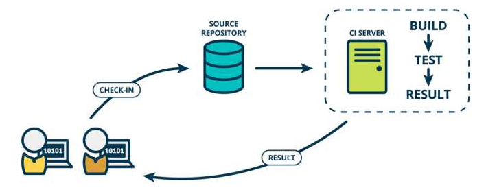
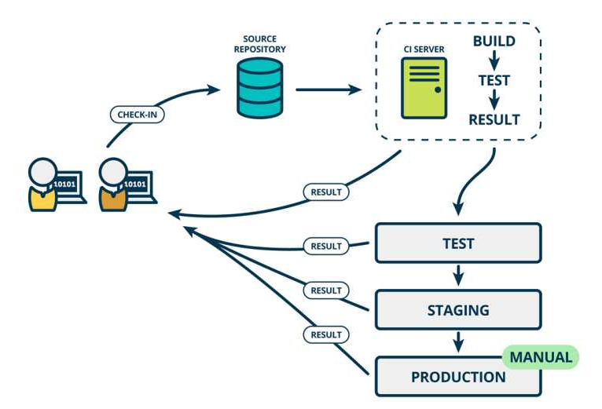
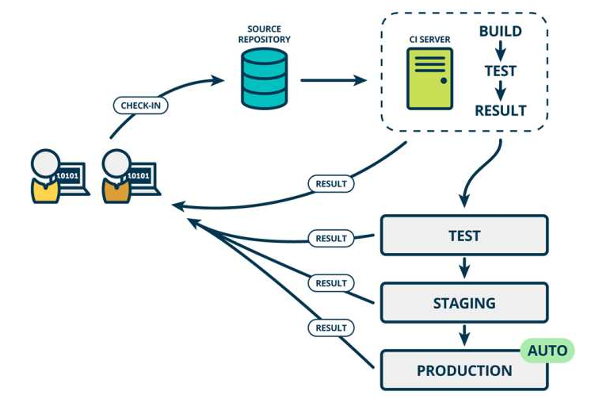
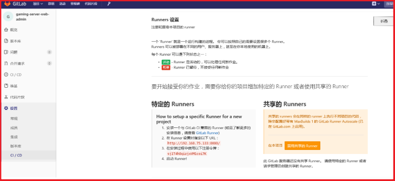
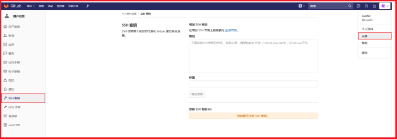
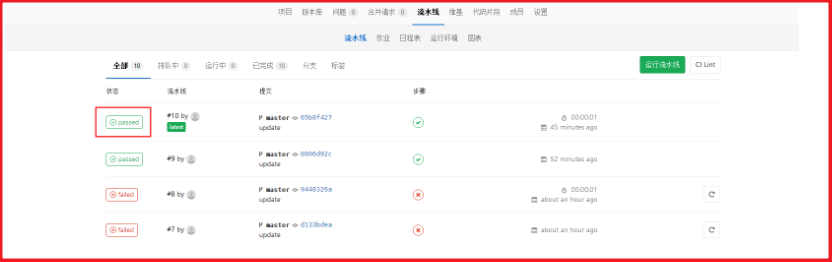

# study-gitlab-CI
学习持续集成的基本知识以及使用gitlab进行持续集成(工具向学习)

# 持续集成的基本概念

## [#](https://www.funtl.com/zh/spring-cloud-itoken-ci/#%E6%9C%AC%E8%8A%82%E8%A7%86%E9%A2%91)本节视频

- [【视频】项目实战-iToken-部署持续集成-持续集成的基本概念](https://www.bilibili.com/video/av28384166)

## [#](https://www.funtl.com/zh/spring-cloud-itoken-ci/#%E6%A6%82%E8%BF%B0)概述

互联网软件的开发和发布，已经形成了一套标准流程，最重要的组成部分就是持续集成（Continuous integration，简称CI）。

## [#](https://www.funtl.com/zh/spring-cloud-itoken-ci/#%E6%8C%81%E7%BB%AD%E9%9B%86%E6%88%90)持续集成

持续集成指的是，频繁地（一天多次）将代码集成到主干。它的好处主要有两个：

- 快速发现错误。每完成一点更新，就集成到主干，可以快速发现错误，定位错误也比较容易。
- 防止分支大幅偏离主干。如果不是经常集成，主干又在不断更新，会导致以后集成的难度变大，甚至难以集成。

Martin Fowler 说过，"持续集成并不能消除 Bug，而是让它们非常容易发现和改正。"




持续集成强调开发人员提交了新代码之后，立刻进行构建、（单元）测试。根据测试结果，我们可以确定新代码和原有代码能否正确地集成在一起。

与持续集成相关的，还有两个概念，分别是持续交付和持续部署。

## [#](https://www.funtl.com/zh/spring-cloud-itoken-ci/#%E6%8C%81%E7%BB%AD%E4%BA%A4%E4%BB%98)持续交付

持续交付（Continuous delivery）指的是，频繁地将软件的新版本，交付给质量团队或者用户，以供评审。如果评审通过，代码就进入生产阶段。

持续交付可以看作持续集成的下一步。它强调的是，不管怎么更新，软件是随时随地可以交付的。




持续交付在持续集成的基础上，将集成后的代码部署到更贴近真实运行环境的「类生产环境」（production-like environments）中。比如，我们完成单元测试后，可以把代码部署到连接数据库的 Staging 环境中更多的测试。如果代码没有问题，可以继续手动部署到生产环境中。

## [#](https://www.funtl.com/zh/spring-cloud-itoken-ci/#%E6%8C%81%E7%BB%AD%E9%83%A8%E7%BD%B2)持续部署

持续部署（continuous deployment）是持续交付的下一步，指的是代码通过评审以后，自动部署到生产环境。

持续部署的目标是，代码在任何时刻都是可部署的，可以进入生产阶段。

持续部署的前提是能自动化完成测试、构建、部署等步骤。




# 持续集成的操作流程

## [#](https://www.funtl.com/zh/spring-cloud-itoken-ci/%E6%8C%81%E7%BB%AD%E9%9B%86%E6%88%90%E7%9A%84%E6%93%8D%E4%BD%9C%E6%B5%81%E7%A8%8B.html#%E6%9C%AC%E8%8A%82%E8%A7%86%E9%A2%91)本节视频

- [【视频】项目实战-iToken-部署持续集成-持续集成的操作流程](https://www.bilibili.com/video/av28384175)

## [#](https://www.funtl.com/zh/spring-cloud-itoken-ci/%E6%8C%81%E7%BB%AD%E9%9B%86%E6%88%90%E7%9A%84%E6%93%8D%E4%BD%9C%E6%B5%81%E7%A8%8B.html#%E6%A6%82%E8%BF%B0)概述

根据持续集成的设计，代码从提交到生产，整个过程有以下几步。

## [#](https://www.funtl.com/zh/spring-cloud-itoken-ci/%E6%8C%81%E7%BB%AD%E9%9B%86%E6%88%90%E7%9A%84%E6%93%8D%E4%BD%9C%E6%B5%81%E7%A8%8B.html#%E6%8F%90%E4%BA%A4)提交

流程的第一步，是开发者向代码仓库提交代码。所有后面的步骤都始于本地代码的一次提交（commit）。

## [#](https://www.funtl.com/zh/spring-cloud-itoken-ci/%E6%8C%81%E7%BB%AD%E9%9B%86%E6%88%90%E7%9A%84%E6%93%8D%E4%BD%9C%E6%B5%81%E7%A8%8B.html#%E6%B5%8B%E8%AF%95%EF%BC%88%E7%AC%AC%E4%B8%80%E8%BD%AE%EF%BC%89)测试（第一轮）

代码仓库对 commit 操作配置了钩子（hook），只要提交代码或者合并进主干，就会跑自动化测试。

测试的种类：

- 单元测试：针对函数或模块的测试
- 集成测试：针对整体产品的某个功能的测试，又称功能测试
- 端对端测试：从用户界面直达数据库的全链路测试

第一轮至少要跑单元测试。

## [#](https://www.funtl.com/zh/spring-cloud-itoken-ci/%E6%8C%81%E7%BB%AD%E9%9B%86%E6%88%90%E7%9A%84%E6%93%8D%E4%BD%9C%E6%B5%81%E7%A8%8B.html#%E6%9E%84%E5%BB%BA)构建

通过第一轮测试，代码就可以合并进主干，就算可以交付了。

交付后，就先进行构建（build），再进入第二轮测试。所谓构建，指的是将源码转换为可以运行的实际代码，比如安装依赖，配置各种资源（样式表、JS脚本、图片）等等。

常用的构建工具如下：

- **Jenkins**
- Travis
- Codeship
- Strider

Jenkins 和 Strider 是开源软件，Travis 和 Codeship 对于开源项目可以免费使用。它们都会将构建和测试，在一次运行中执行完成。

## [#](https://www.funtl.com/zh/spring-cloud-itoken-ci/%E6%8C%81%E7%BB%AD%E9%9B%86%E6%88%90%E7%9A%84%E6%93%8D%E4%BD%9C%E6%B5%81%E7%A8%8B.html#%E6%B5%8B%E8%AF%95%EF%BC%88%E7%AC%AC%E4%BA%8C%E8%BD%AE%EF%BC%89)测试（第二轮）

构建完成，就要进行第二轮测试。如果第一轮已经涵盖了所有测试内容，第二轮可以省略，当然，这时构建步骤也要移到第一轮测试前面。

第二轮是全面测试，单元测试和集成测试都会跑，有条件的话，也要做端对端测试。所有测试以自动化为主，少数无法自动化的测试用例，就要人工跑。

需要强调的是，新版本的每一个更新点都必须测试到。如果测试的覆盖率不高，进入后面的部署阶段后，很可能会出现严重的问题。

## [#](https://www.funtl.com/zh/spring-cloud-itoken-ci/%E6%8C%81%E7%BB%AD%E9%9B%86%E6%88%90%E7%9A%84%E6%93%8D%E4%BD%9C%E6%B5%81%E7%A8%8B.html#%E9%83%A8%E7%BD%B2)部署

通过了第二轮测试，当前代码就是一个可以直接部署的版本（artifact）。将这个版本的所有文件打包（ tar filename.tar * ）存档，发到生产服务器。

生产服务器将打包文件，解包成本地的一个目录，再将运行路径的符号链接（symlink）指向这个目录，然后重新启动应用。这方面的部署工具有Ansible，Chef，Puppet等。

## [#](https://www.funtl.com/zh/spring-cloud-itoken-ci/%E6%8C%81%E7%BB%AD%E9%9B%86%E6%88%90%E7%9A%84%E6%93%8D%E4%BD%9C%E6%B5%81%E7%A8%8B.html#%E5%9B%9E%E6%BB%9A)回滚

一旦当前版本发生问题，就要回滚到上一个版本的构建结果。最简单的做法就是修改一下符号链接，指向上一个版本的目录。

# 使用 GitLab 持续集成

## [#](https://www.funtl.com/zh/spring-cloud-itoken-ci/%E4%BD%BF%E7%94%A8-GitLab-%E6%8C%81%E7%BB%AD%E9%9B%86%E6%88%90.html#%E6%9C%AC%E8%8A%82%E8%A7%86%E9%A2%91)本节视频

- [【视频】项目实战-iToken-部署持续集成-使用 GitLab 持续集成](https://www.bilibili.com/video/av28384193)

## [#](https://www.funtl.com/zh/spring-cloud-itoken-ci/%E4%BD%BF%E7%94%A8-GitLab-%E6%8C%81%E7%BB%AD%E9%9B%86%E6%88%90.html#%E7%AE%80%E4%BB%8B)简介

从 GitLab 8.0 开始，GitLab CI 就已经集成在 GitLab 中，我们只要在项目中添加一个 `.gitlab-ci.yml` 文件，然后添加一个 Runner，即可进行持续集成。 而且随着 GitLab 的升级，GitLab CI 变得越来越强大。

## [#](https://www.funtl.com/zh/spring-cloud-itoken-ci/%E4%BD%BF%E7%94%A8-GitLab-%E6%8C%81%E7%BB%AD%E9%9B%86%E6%88%90.html#%E6%A6%82%E5%BF%B5)概念

### [#](https://www.funtl.com/zh/spring-cloud-itoken-ci/%E4%BD%BF%E7%94%A8-GitLab-%E6%8C%81%E7%BB%AD%E9%9B%86%E6%88%90.html#pipeline)Pipeline

一次 Pipeline 其实相当于一次构建任务，里面可以包含多个流程，如安装依赖、运行测试、编译、部署测试服务器、部署生产服务器等流程。

任何提交或者 Merge Request 的合并都可以触发 Pipeline，如下图所示：

```text
+------------------+           +----------------+
|                  |  trigger  |                |
|   Commit / MR    +---------->+    Pipeline    |
|                  |           |                |
+------------------+           +----------------+
```

### [#](https://www.funtl.com/zh/spring-cloud-itoken-ci/%E4%BD%BF%E7%94%A8-GitLab-%E6%8C%81%E7%BB%AD%E9%9B%86%E6%88%90.html#stages)Stages

Stages 表示构建阶段，说白了就是上面提到的流程。我们可以在一次 Pipeline 中定义多个 Stages，这些 Stages 会有以下特点：

- 所有 Stages 会按照顺序运行，即当一个 Stage 完成后，下一个 Stage 才会开始
- 只有当所有 Stages 完成后，该构建任务 (Pipeline) 才会成功
- 如果任何一个 Stage 失败，那么后面的 Stages 不会执行，该构建任务 (Pipeline) 失败

因此，Stages 和 Pipeline 的关系就是：

```text
+--------------------------------------------------------+
|                                                        |
|  Pipeline                                              |
|                                                        |
|  +-----------+     +------------+      +------------+  |
|  |  Stage 1  |---->|   Stage 2  |----->|   Stage 3  |  |
|  +-----------+     +------------+      +------------+  |
|                                                        |
+--------------------------------------------------------+
```

### [#](https://www.funtl.com/zh/spring-cloud-itoken-ci/%E4%BD%BF%E7%94%A8-GitLab-%E6%8C%81%E7%BB%AD%E9%9B%86%E6%88%90.html#jobs)Jobs

Jobs 表示构建工作，表示某个 Stage 里面执行的工作。我们可以在 Stages 里面定义多个 Jobs，这些 Jobs 会有以下特点：

- 相同 Stage 中的 Jobs 会并行执行
- 相同 Stage 中的 Jobs 都执行成功时，该 Stage 才会成功
- 如果任何一个 Job 失败，那么该 Stage 失败，即该构建任务 (Pipeline) 失败

所以，Jobs 和 Stage 的关系图就是：

```text
+------------------------------------------+
|                                          |
|  Stage 1                                 |
|                                          |
|  +---------+  +---------+  +---------+   |
|  |  Job 1  |  |  Job 2  |  |  Job 3  |   |
|  +---------+  +---------+  +---------+   |
|                                          |
+------------------------------------------+
```


  [#](https://www.funtl.com/zh/spring-cloud-itoken-ci/%E4%BD%BF%E7%94%A8-GitLab-Runner.html#%E4%BD%BF%E7%94%A8-gitlab-runner)使用 GitLab Runner

## [#](https://www.funtl.com/zh/spring-cloud-itoken-ci/%E4%BD%BF%E7%94%A8-GitLab-Runner.html#%E6%9C%AC%E8%8A%82%E8%A7%86%E9%A2%91)本节视频

- [【视频】项目实战-iToken-部署持续集成-使用 GitLab Runner](https://www.bilibili.com/video/av28384201)

## [#](https://www.funtl.com/zh/spring-cloud-itoken-ci/%E4%BD%BF%E7%94%A8-GitLab-Runner.html#%E7%AE%80%E4%BB%8B)简介

理解了上面的基本概念之后，有没有觉得少了些什么东西 —— 由谁来执行这些构建任务呢？ 答案就是 GitLab Runner 了！

想问为什么不是 GitLab CI 来运行那些构建任务？

一般来说，构建任务都会占用很多的系统资源 (譬如编译代码)，而 GitLab CI 又是 GitLab 的一部分，如果由 GitLab CI 来运行构建任务的话，在执行构建任务的时候，GitLab 的性能会大幅下降。

GitLab CI 最大的作用是管理各个项目的构建状态，因此，运行构建任务这种浪费资源的事情就交给 GitLab Runner 来做拉！

因为 GitLab Runner 可以安装到不同的机器上，所以在构建任务运行期间并不会影响到 GitLab 的性能

## [#](https://www.funtl.com/zh/spring-cloud-itoken-ci/%E4%BD%BF%E7%94%A8-GitLab-Runner.html#%E5%AE%89%E8%A3%85)安装

- 在目标主机上安装 GitLab Runner，这里的目标主机指你要部署的服务器
- Ubuntu 安装脚本：

```text
curl -L https://packages.gitlab.com/install/repositories/runner/gitlab-ci-multi-runner/script.deb.sh | sudo bash
sudo apt-get update
sudo apt-get install gitlab-ci-multi-runner
```

1
2
3

## [#](https://www.funtl.com/zh/spring-cloud-itoken-ci/%E4%BD%BF%E7%94%A8-GitLab-Runner.html#%E6%B3%A8%E5%86%8C-runner)注册 Runner

安装好 GitLab Runner 之后，我们只要启动 Runner 然后和 GitLab CI 绑定：

```text
[root@iZbp1fmnx8oyubksjdk7leZ gitbook]# gitlab-ci-multi-runner register
Running in system-mode.                            
                                                   
Please enter the gitlab-ci coordinator URL (e.g. https://gitlab.com/):
http://192.168.75.146:8080/
Please enter the gitlab-ci token for this runner:
1Lxq_f1NRfCfeNbE5WRh
Please enter the gitlab-ci description for this runner:
[iZbp1fmnx8oyubksjdk7leZ]: deploy-gaming
Please enter the gitlab-ci tags for this runner (comma separated):
deploy
Whether to run untagged builds [true/false]:
[false]: true
Whether to lock Runner to current project [true/false]:
[false]: 
Registering runner... succeeded                     runner=P_zfkhTb
Please enter the executor: virtualbox, docker+machine, parallels, shell, ssh, docker-ssh+machine, kubernetes, docker, docker-ssh:
shell
Runner registered successfully. Feel free to start it, but if it's running already the config should be automatically reloaded! 
```

说明：

- gitlab-ci-multi-runner register：执行注册命令
- Please enter the gitlab-ci coordinator URL：输入 ci 地址
- Please enter the gitlab-ci token for this runner：输入 ci token
- Please enter the gitlab-ci description for this runner：输入 runner 名称
- Please enter the gitlab-ci tags for this runner：设置 tag
- Whether to run untagged builds：这里选择 true ，代码上传后会能够直接执行
- Whether to lock Runner to current project：直接回车，不用输入任何口令
- Please enter the executor：选择 runner 类型，这里我们选择的是 shell

CI 的地址和令牌，在 项目 --> 设置 --> CI/CD --> Runner 设置：




## [#](https://www.funtl.com/zh/spring-cloud-itoken-ci/%E4%BD%BF%E7%94%A8-GitLab-Runner.html#gitlab-ci-yml).gitlab-ci.yml

在项目工程下编写 .gitlab-ci.yml 配置文件：

```text
stages:
  - install_deps
  - test
  - build
  - deploy_test
  - deploy_production

cache:
  key: ${CI_BUILD_REF_NAME}
  paths:
    - node_modules/
    - dist/

# 安装依赖
install_deps:
  stage: install_deps
  only:
    - develop
    - master
  script:
    - npm install

# 运行测试用例
test:
  stage: test
  only:
    - develop
    - master
  script:
    - npm run test

# 编译
build:
  stage: build
  only:
    - develop
    - master
  script:
    - npm run clean
    - npm run build:client
    - npm run build:server

# 部署测试服务器
deploy_test:
  stage: deploy_test
  only:
    - develop
  script:
    - pm2 delete app || true
    - pm2 start app.js --name app

# 部署生产服务器
deploy_production:
  stage: deploy_production
  only:
    - master
  script:
    - bash scripts/deploy/deploy.sh
```

上面的配置把一次 Pipeline 分成五个阶段：

- 安装依赖(install_deps)
- 运行测试(test)
- 编译(build)
- 部署测试服务器(deploy_test)
- 部署生产服务器(deploy_production)

设置 Job.only 后，只有当 develop 分支和 master 分支有提交的时候才会触发相关的 Jobs。

节点说明：

- stages：定义构建阶段，这里只有一个阶段 deploy
- deploy：构建阶段 deploy 的详细配置也就是任务配置
- script：需要执行的 shell 脚本
- only：这里的 master 指在提交到 master 时执行
- tags：与注册 runner 时的 tag 匹配

## [#](https://www.funtl.com/zh/spring-cloud-itoken-ci/%E4%BD%BF%E7%94%A8-GitLab-Runner.html#%E5%85%B6%E5%AE%83%E9%85%8D%E7%BD%AE)其它配置

为保证能够正常集成，我们还需要一些其它配置：

- 安装完 GitLab Runner 后系统会增加一个 gitlab-runner 账户，我们将它加进 root 组：

```text
gpasswd -a gitlab-runner root
```

- 配置需要操作目录的权限，比如你的 runner 要在 gaming 目录下操作：

```text
chmod 775 gaming
```

- 由于我们的 shell 脚本中有执行 git pull 的命令，我们直接设置以 ssh 方式拉取代码：

```text
su gitlab-runner
ssh-keygen -t rsa -C "你在 GitLab 上的邮箱地址"
cd 
cd .ssh
cat id_rsa.pub
```

- 复制 id_rsa.pub 中的秘钥到 GitLab：




- 通过 ssh 的方式将代码拉取到本地

## [#](https://www.funtl.com/zh/spring-cloud-itoken-ci/%E4%BD%BF%E7%94%A8-GitLab-Runner.html#%E6%B5%8B%E8%AF%95%E9%9B%86%E6%88%90%E6%95%88%E6%9E%9C)测试集成效果

所有操作完成后 push 代码到服务器，查看是否成功：




passed 表示执行成功

## [#](https://www.funtl.com/zh/spring-cloud-itoken-ci/%E4%BD%BF%E7%94%A8-GitLab-Runner.html#%E5%85%B6%E4%BB%96%E5%91%BD%E4%BB%A4)其他命令

删除注册信息：

```text
gitlab-ci-multi-runner unregister --name "名称"
```

查看注册列表：

```text
gitlab-ci-multi-runner list
```


  [#](https://www.funtl.com/zh/spring-cloud-itoken-ci/%E4%BD%BF%E7%94%A8-GitLab-Runner-Docker.html#%E4%BD%BF%E7%94%A8-gitlab-runner-docker)使用 GitLab Runner Docker

## [#](https://www.funtl.com/zh/spring-cloud-itoken-ci/%E4%BD%BF%E7%94%A8-GitLab-Runner-Docker.html#%E6%9C%AC%E8%8A%82%E8%A7%86%E9%A2%91)本节视频

- [【视频】项目实战-iToken-部署持续集成-使用 GitLab Runner Docker](https://www.bilibili.com/video/av28384215)
- [【视频】项目实战-iToken-部署持续集成-第一个 GitLab Runner 脚本](https://www.bilibili.com/video/av28384268)
- [【视频】项目实战-iToken-部署持续集成-实战分布式配置中心](https://www.bilibili.com/video/av28384251)
- [【视频】项目实战-iToken-部署持续集成-实战服务注册与发现](https://www.bilibili.com/video/av28384230)

## [#](https://www.funtl.com/zh/spring-cloud-itoken-ci/%E4%BD%BF%E7%94%A8-GitLab-Runner-Docker.html#%E6%A6%82%E8%BF%B0)概述

为了配置方便，我们使用 `docker` 来部署 `GitLab Runner`

## [#](https://www.funtl.com/zh/spring-cloud-itoken-ci/%E4%BD%BF%E7%94%A8-GitLab-Runner-Docker.html#%E7%8E%AF%E5%A2%83%E5%87%86%E5%A4%87)环境准备

- 创建工作目录 `/usr/local/docker/runner`
- 创建构建目录 `/usr/local/docker/runner/environment`
- 下载 `jdk-8u152-linux-x64.tar.gz` 并复制到 `/usr/local/docker/runner/environment`

## [#](https://www.funtl.com/zh/spring-cloud-itoken-ci/%E4%BD%BF%E7%94%A8-GitLab-Runner-Docker.html#dockerfile)Dockerfile

在 `/usr/local/docker/runner/environment` 目录下创建 `Dockerfile`

```text
FROM gitlab/gitlab-runner:v11.0.2
MAINTAINER Lusifer <topsale@vip.qq.com>

# 修改软件源
RUN echo 'deb http://mirrors.aliyun.com/ubuntu/ xenial main restricted universe multiverse' > /etc/apt/sources.list && \
    echo 'deb http://mirrors.aliyun.com/ubuntu/ xenial-security main restricted universe multiverse' >> /etc/apt/sources.list && \
    echo 'deb http://mirrors.aliyun.com/ubuntu/ xenial-updates main restricted universe multiverse' >> /etc/apt/sources.list && \
    echo 'deb http://mirrors.aliyun.com/ubuntu/ xenial-backports main restricted universe multiverse' >> /etc/apt/sources.list && \
    apt-get update -y && \
    apt-get clean

# 安装 Docker
RUN apt-get -y install apt-transport-https ca-certificates curl software-properties-common && \
    curl -fsSL http://mirrors.aliyun.com/docker-ce/linux/ubuntu/gpg | apt-key add - && \
    add-apt-repository "deb [arch=amd64] http://mirrors.aliyun.com/docker-ce/linux/ubuntu $(lsb_release -cs) stable" && \
    apt-get update -y && \
    apt-get install -y docker-ce
COPY daemon.json /etc/docker/daemon.json

# 安装 Docker Compose
WORKDIR /usr/local/bin
RUN wget https://raw.githubusercontent.com/topsale/resources/master/docker/docker-compose
RUN chmod +x docker-compose

# 安装 Java
RUN mkdir -p /usr/local/java
WORKDIR /usr/local/java
COPY jdk-8u152-linux-x64.tar.gz /usr/local/java
RUN tar -zxvf jdk-8u152-linux-x64.tar.gz && \
    rm -fr jdk-8u152-linux-x64.tar.gz

# 安装 Maven
RUN mkdir -p /usr/local/maven
WORKDIR /usr/local/maven
RUN wget https://raw.githubusercontent.com/topsale/resources/master/maven/apache-maven-3.5.3-bin.tar.gz
# COPY apache-maven-3.5.3-bin.tar.gz /usr/local/maven
RUN tar -zxvf apache-maven-3.5.3-bin.tar.gz && \
    rm -fr apache-maven-3.5.3-bin.tar.gz
# COPY settings.xml /usr/local/maven/apache-maven-3.5.3/conf/settings.xml

# 配置环境变量
ENV JAVA_HOME /usr/local/java/jdk1.8.0_152
ENV MAVEN_HOME /usr/local/maven/apache-maven-3.5.3
ENV PATH $PATH:$JAVA_HOME/bin:$MAVEN_HOME/bin

WORKDIR /
```

## [#](https://www.funtl.com/zh/spring-cloud-itoken-ci/%E4%BD%BF%E7%94%A8-GitLab-Runner-Docker.html#daemon-json)daemon.json

在 `/usr/local/docker/runner/environment` 目录下创建 `daemon.json`，用于配置加速器和仓库地址

```text
{
  "registry-mirrors": [
    "https://registry.docker-cn.com"
  ],
  "insecure-registries": [
    "192.168.75.131:5000"
  ]
}
```

## [#](https://www.funtl.com/zh/spring-cloud-itoken-ci/%E4%BD%BF%E7%94%A8-GitLab-Runner-Docker.html#docker-compose-yml)docker-compose.yml

在 `/usr/local/docker/runner` 目录下创建 `docker-compose.yml`

```text
version: '3.1'
services:
  gitlab-runner:
    build: environment
    restart: always
    container_name: gitlab-runner
    privileged: true
    volumes:
      - /usr/local/docker/runner/config:/etc/gitlab-runner
      - /var/run/docker.sock:/var/run/docker.sock
```

## [#](https://www.funtl.com/zh/spring-cloud-itoken-ci/%E4%BD%BF%E7%94%A8-GitLab-Runner-Docker.html#%E6%B3%A8%E5%86%8C-runner)注册 Runner

```text
docker exec -it gitlab-runner gitlab-runner register

# 输入 GitLab 地址
Please enter the gitlab-ci coordinator URL (e.g. https://gitlab.com/):
http://192.168.75.146:8080/

# 输入 GitLab Token
Please enter the gitlab-ci token for this runner:
1Lxq_f1NRfCfeNbE5WRh

# 输入 Runner 的说明
Please enter the gitlab-ci description for this runner:
可以为空

# 设置 Tag，可以用于指定在构建规定的 tag 时触发 ci
Please enter the gitlab-ci tags for this runner (comma separated):
deploy

# 这里选择 true ，可以用于代码上传后直接执行
Whether to run untagged builds [true/false]:
true

# 这里选择 false，可以直接回车，默认为 false
Whether to lock Runner to current project [true/false]:
false

# 选择 runner 执行器，这里我们选择的是 shell
Please enter the executor: virtualbox, docker+machine, parallels, shell, ssh, docker-ssh+machine, kubernetes, docker, docker-ssh:
shell
```

## [#](https://www.funtl.com/zh/spring-cloud-itoken-ci/%E4%BD%BF%E7%94%A8-GitLab-Runner-Docker.html#%E9%99%84%EF%BC%9A%E9%A1%B9%E7%9B%AE%E9%85%8D%E7%BD%AE-dockerfile-%E6%A1%88%E4%BE%8B)附：项目配置 Dockerfile 案例

```text
FROM openjdk:8-jre

MAINTAINER Lusifer <topsale@vip.qq.com>

ENV APP_VERSION 1.0.0-SNAPSHOT
ENV DOCKERIZE_VERSION v0.6.1
RUN wget https://github.com/jwilder/dockerize/releases/download/$DOCKERIZE_VERSION/dockerize-linux-amd64-$DOCKERIZE_VERSION.tar.gz \
    && tar -C /usr/local/bin -xzvf dockerize-linux-amd64-$DOCKERIZE_VERSION.tar.gz \
    && rm dockerize-linux-amd64-$DOCKERIZE_VERSION.tar.gz

RUN mkdir /app

COPY itoken-eureka-$APP_VERSION.jar /app/app.jar
ENTRYPOINT ["dockerize", "-timeout", "5m", "-wait", "tcp://192.168.75.128:8888", "java", "-Djava.security.egd=file:/dev/./urandom", "-jar", "/app/app.jar", "--spring.profiles.active=prod"]

EXPOSE 8761
  
```